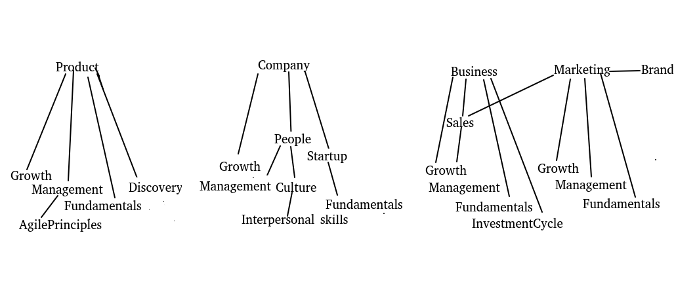

# blogAggregation
The Grouping of 117 instances of the different blogs has to be done in the following way

1. Marketing
2. Branding
3. Growth marketing

4. Growth strategies

5. Product Management
6. Product discovery
7. Product Growth
8. Product Management Fundamentals
9. Agile principles

10. Company Culture
11. Company Growth
12. People Management
13. Startup Fundamentals
14. Interpersonal skills

15. Business Fundamentals
16. Business Growth
17. Sales Growth
18. Investment cycle

I tried to club them together as shown in image 

- [x] Gather data in `raw_blog_content.csv`
- [ ] Clean data
- [ ] Build Feature
- [ ] Create Model
- [ ] Evaluate
